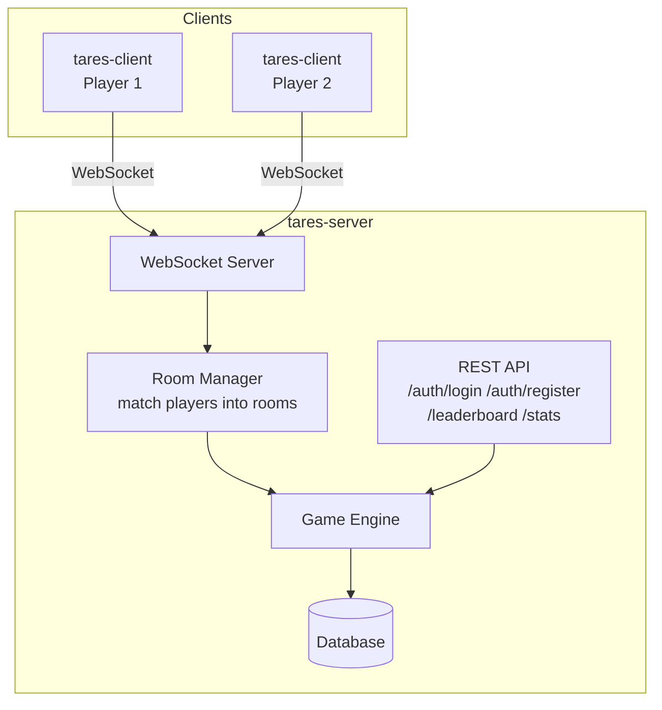

# Tares CLI

Terminal-based multiplayer word scramble game built in Go.

## Architecture

## Notes

- GitHub renders Mermaid diagrams directly.
- If a renderer does not support Mermaid, it will fall back to showing the fenced block as text.
