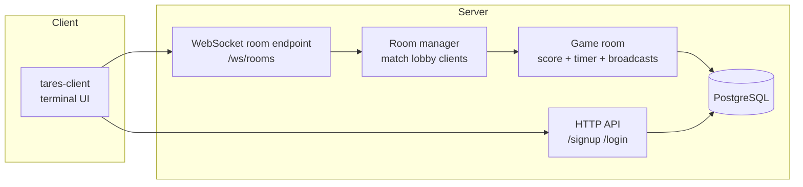
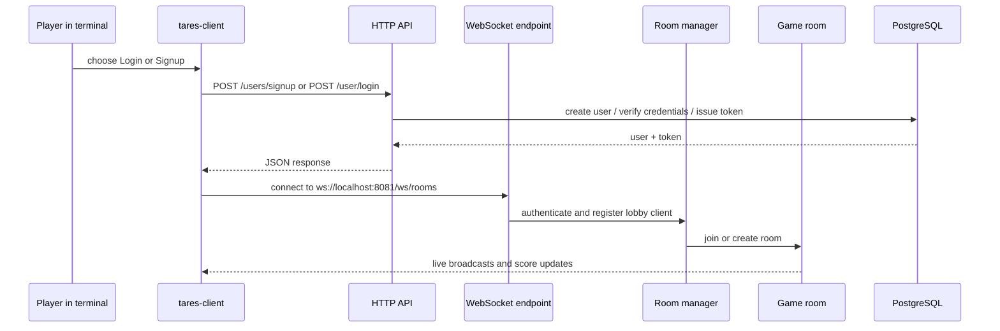
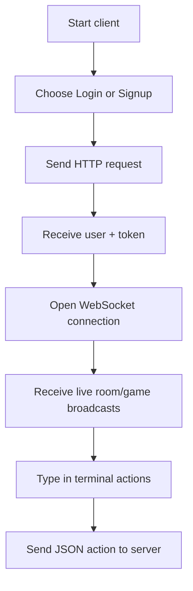

# Tares CLI

Tares CLI is a terminal-based multiplayer word scramble game written in Go.
Players authenticate from the terminal, connect over WebSocket, and receive live game updates in the same window.

## What Lives In The Repo



## How It Works



## Quick Start

### Requirements

- Go 1.26.3 or compatible
- PostgreSQL running locally
- A database named `tares_db`

### Database Connection

The server currently opens PostgreSQL with this connection string:

```text
host=localhost user=logic dbname=tares_db port=5433 password=logicgate sslmode=disable
```

Adjust your local database to match that configuration, or update the server code before running.

### Run The Server

```bash
go run ./server
```

The server listens on port `8081` by default and applies database migrations on startup.

### Run The Client

```bash
go run ./client
```

The client will prompt you to:

1. Login
2. Signup
3. Exit


After authentication, it opens a WebSocket connection to:

```text
ws://localhost:8081/ws/rooms
```

## Terminal Flow



## Supported Client Actions

The client currently sends these actions after the socket is open:

- `SEND_WORD`
- `PAUSE_GAME`
- `RESUME_GAME`
- `STOP_GAME`

## Project Layout

```text
client/
	main.go                 terminal entrypoint
	helpers/                auth and HTTP helper functions

server/
	main.go                 server entrypoint
	internals/api/          HTTP handlers
	internals/middleware/   request auth middleware
	internals/route/        route registration
	internals/ws/           room manager and websocket clients
	internals/store/        database access
	migrations/             goose migrations
	dictionary/             word lists
```