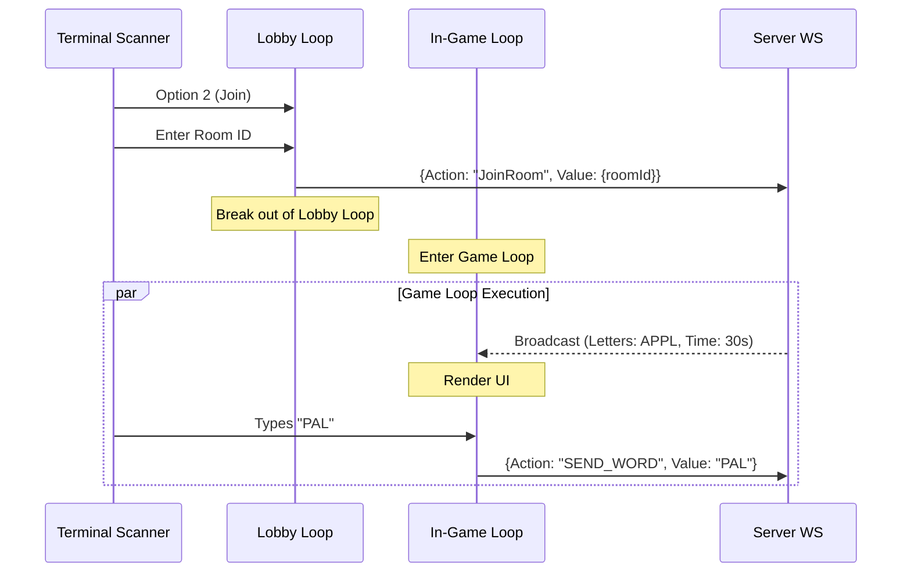
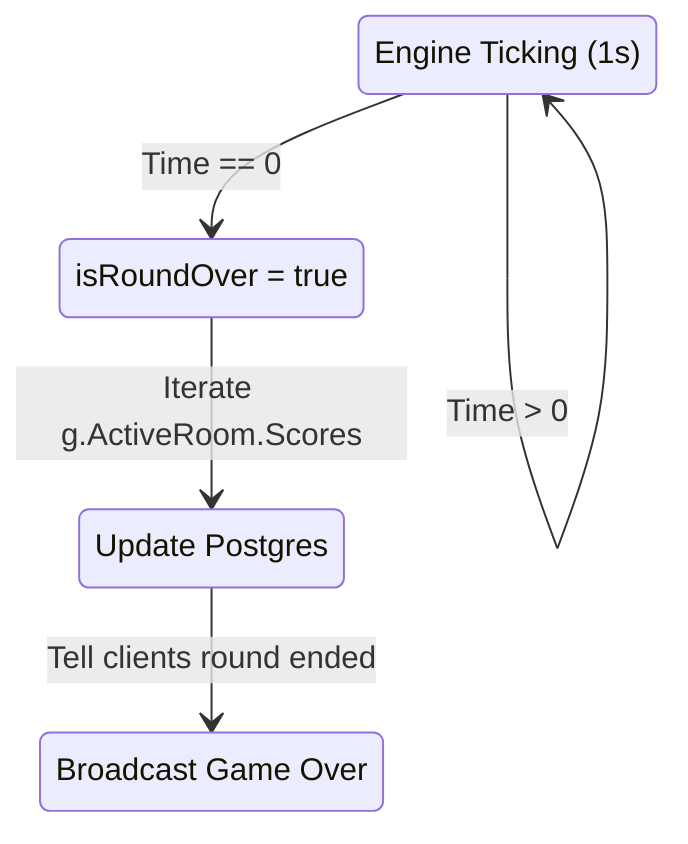

# TARES CLI: Development Master Guide & Roadmap

This document serves as the master blueprint for the Tares CLI game. It outlines the core philosophy, current progress, remaining tasks, and how the entire system architecture connects together.

## 1. Game Philosophy & Overview

**Tares CLI** is a terminal-based multiplayer word scramble game written in Go.
*   **Connections:** Players authenticate and connect via WebSockets directly from their terminal.
*   **Matchmaking:** A centralized Game Manager routes users to available rooms, or places them in a lobby if they wait.
*   **Scoring (The Creed Board):** Scores are accumulated based on difficulty (Easy, Medium, Hard, Extreme) and player count multipliers. The top 100 players are featured on the Creed Board.
*   **Performance Philosophy:** *"Hit DB less, worry less about DB latency."* Game state is held entirely in-memory using goroutines and mutexes during gameplay. The PostgreSQL database is only written to when a game concludes.

---

## 2. How the Puzzle Connects (System Architecture)

The system relies on a seamless transition from standard HTTP REST to real-time WebSockets, followed by independent room-level game loops.

```mermaid
flowchart TD
    subgraph Client [Tares Terminal Client]
        UI[Terminal UI & Scanner]
        API_C[HTTP Client]
        WS_C[WebSocket Client]
        
        UI --> API_C : Login/Register
        UI --> WS_C : Real-time actions
    end

    subgraph Server [Tares Go Server]
        API_S[REST API /auth] 
        WS_M[Room Manager / Lobby]
        
        subgraph Rooms [Active Game Rooms]
            R1[Room 1: Game Engine]
            R2[Room 2: Game Engine]
        end
        
        API_C -->|POST credentials| API_S
        WS_C -->|ws:// Upgrade| WS_M
        WS_M -->|Matches & Routes| R1
        WS_M -->|Matches & Routes| R2
    end

    subgraph Database [PostgreSQL]
        DB[(Users & Scores)]
        API_S <-->|Verify/Create| DB
        R1 -.->|Batch update at GameOver| DB
        R2 -.->|Batch update at GameOver| DB
    end
```

### The Communication Loop
1. **Pumps:** The client uses two goroutines (read pump / write pump) to talk to the server asynchronously so standard input `bufio.Scanner` doesn't block incoming server broadcasts.
2. **State Sync:** The `GameEngine` runs a 1-second `Tick()`, which checks the timer and broadcasts `GameStateBroadcast` payloads to all clients in that specific `Room`.
3. **Action Sync:** When a user types a word, a `SEND_WORD` JSON payload is fired to the room, scored against the dictionary, and the player's in-memory score is instantly updated.

---

## 3. Current Progress: What is Accomplished

### 🟢 Server-Side (Accomplished)
*   **Database & Schema:** PostgreSQL integration is set up with Goose migrations. `store` logic for users and scores is initialized.
*   **Authentication:** HTTP `/login` and `/signup` endpoints are functional. JWT middleware is in place for route protection.
*   **WebSocket Upgrader & Manager:** `roomManager` successfully handles the `/ws/rooms` endpoint, upgrading the connection, creating a `client` struct, and placing them in the lobby.
*   **Room Logic:** Users can create and list rooms. The Lobby accurately broadcasts the list of available rooms.
*   **Engine Foundations:** `engine.Game` exists. The `Tick()` timer works. The `ScoreWord` logic (with difficulty multipliers) and `ValidateWord` against the dictionary file are built. `GroupLetters` exists to generate a valid scramble.

### 🟢 Client-Side (Accomplished)
*   **Auth Flow:** The CLI prompts for login/signup, stores the token, and connects to the WS endpoint.
*   **Concurrency Setup:** Channels (`inGameAction`, `inLobbyAction`, `lobbyMsg`, `gameMsg`) and goroutines are wired up to handle JSON marshaling/unmarshaling over the socket.
*   **Lobby UI:** The interactive terminal loops for Lobby actions (like `1. View Available Rooms`) and correctly prints tabular data using `tabwriter`.

---

## 4. Remaining Work: What Needs to be Done

While the scaffolding is 90% complete, the actual transition into gameplay and the post-game cleanup are missing.

### 🔴 Server-Side (Remaining)
1. **Initialize Game (`ws/room.go`):** 
   Inside `Run()`, the `case "START_GAME":` logic is empty. It needs to:
   * Generate letters via `GroupLetters()`.
   * Set the initial time limit.
   * Spawn the `go r.gameEngine.Run(...)` goroutine to start ticking.
2. **Handle Game Over & DB Writes (`engine/manager.go`):**
   When `Tick()` returns `isRoundOver == true`, the engine must loop through `g.ActiveRoom.Scores` and write the final totals to PostgreSQL, fulfilling the "Hit DB Less" philosophy.
3. **The Creed Board API (`internals/api/`):**
   Create a `GET /leaderboard` HTTP endpoint that queries the DB for the top 100 users based on total score.

### 🔴 Client-Side (Remaining)
1. **Join Room Action (`client/main.go`):**
   Implement `case "2":` in the main lobby menu. Prompt the user for a `Room ID` and send a `JoinRoom` event.
2. **The In-Game Loop:**
   Once joined, the CLI needs a distinct game loop. It must clear the screen, display the current scrambled letters and time left (from the `gameMsg` channel), and listen for typed words to send as `SEND_WORD` events.
3. **Creed Board View:**
   Add a menu option to fetch and display the HTTP `GET /leaderboard` payload.

---

## 5. Connecting the Missing Logic (Implementation Guide)

### Connecting the Client to the Game Room
When a user selects "Join Room", the state machine must shift from Lobby to Game. 



**How to code it in `client/main.go`:**
Wrap your existing scanner loop in a Lobby function/block. When `JoinRoom` succeeds, break the loop and start a new one:
```go
// Psuedo-code for the In-Game Loop
for {
    select {
    case state := <-gameMsg:
        // Clear terminal
        fmt.Print("\033[H\033[2J") 
        fmt.Printf("Time Left: %d | Scramble: %v\n", state.TimeLeft, state.ScrambledWord)
        fmt.Printf("Your Score: %d\n", state.Scores[myUserId])
        fmt.Print("Enter word: ")
    default:
        // non-blocking read from stdin (or run in separate goroutine)
    }
}
```

### Connecting the Server Engine to the DB
At the end of a round, the state must sync back to the database. 



**How to code it in `engine/manager.go`:**
Inside the `Run` function:
```go
// engine/manager.go
if isRoundOver {
    for playerId, score := range g.ActiveRoom.Scores {
        // Pseudo code for DB store call
        store.AddScoreToUser(playerId, score) 
    }
    state.Round++
    state.TimeLeft = int(g.Duration.Seconds())
    // ... broadcast round over ...
}
```