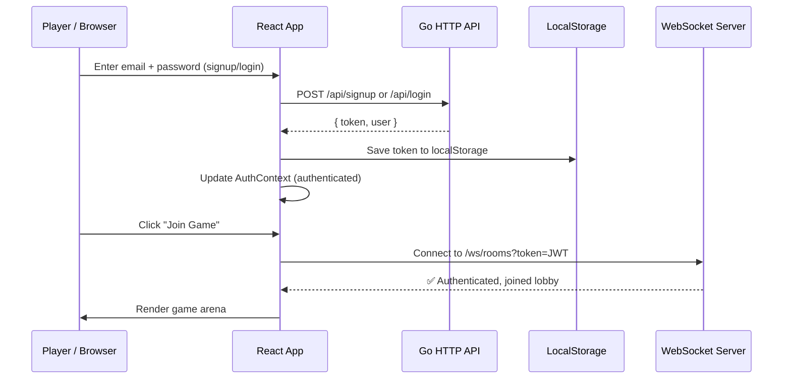

Perfect! I'll use that **sequenceDiagram** format going forward. Much clearer.

---

# Stage 2: Authentication (Login/Signup)

**The pain:** Without auth, we can't track players, persist scores, or know who's in the game. We need secure login/signup with JWT tokens stored in the frontend and validated by the Go backend.

> **Core principle: Auth state is a state machine.** Idle → Loading → Authenticated or Error. The Context holds the token; the API service sends it on every request.

---

## Architecture



---

## Files to Create

### 1. `web-client/src/types/api.ts`

**Reason:** All API response types in one place. TypeScript ensures mismatched responses are caught at compile time.

```typescript
// Auth responses
export interface SignupRequest {
  email: string
  password: string
}

export interface LoginRequest {
  email: string
  password: string
}

export interface AuthResponse {
  token: string
  user: {
    id: string
    email: string
    createdAt: string
  }
}

export interface ErrorResponse {
  error: string
  details?: string
}
```

---

### 2. `web-client/src/services/api.ts`

**Reason:** HTTP client. All API calls go through here. Token is auto-injected on every request.

```typescript
import axios, { AxiosInstance } from 'axios'
import type { AuthResponse, SignupRequest, LoginRequest, ErrorResponse } from '@types/api'

class APIClient {
  private client: AxiosInstance
  private token: string | null = null

  constructor(baseURL: string = '/api') {
    this.client = axios.create({
      baseURL,
      headers: {
        'Content-Type': 'application/json',
      },
    })

    // Auto-inject token on every request
    this.client.interceptors.request.use((config) => {
      if (this.token) {
        config.headers.Authorization = `Bearer ${this.token}`
      }
      return config
    })
  }

  setToken(token: string | null) {
    this.token = token
  }

  async signup(email: string, password: string): Promise<AuthResponse> {
    try {
      const res = await this.client.post<AuthResponse>('/auth/signup', {
        email,
        password,
      })
      return res.data
    } catch (error: any) {
      throw new Error(error.response?.data?.error || 'Signup failed')
    }
  }

  async login(email: string, password: string): Promise<AuthResponse> {
    try {
      const res = await this.client.post<AuthResponse>('/auth/login', {
        email,
        password,
      })
      return res.data
    } catch (error: any) {
      throw new Error(error.response?.data?.error || 'Login failed')
    }
  }
}

export const apiClient = new APIClient()
```

---

### 3. `web-client/src/state/authReducer.ts`

**Reason:** State machine for auth. Actions: LOGIN_START, LOGIN_SUCCESS, LOGIN_ERROR, LOGOUT.

```typescript
export interface AuthState {
  user: { id: string; email: string } | null
  token: string | null
  isLoading: boolean
  error: string | null
  isAuthenticated: boolean
}

export type AuthAction =
  | { type: 'LOGIN_START' }
  | { type: 'LOGIN_SUCCESS'; payload: { token: string; user: { id: string; email: string } } }
  | { type: 'LOGIN_ERROR'; payload: string }
  | { type: 'LOGOUT' }
  | { type: 'RESTORE_TOKEN'; payload: string } // On app load

export const initialAuthState: AuthState = {
  user: null,
  token: null,
  isLoading: false,
  error: null,
  isAuthenticated: false,
}

export function authReducer(state: AuthState, action: AuthAction): AuthState {
  switch (action.type) {
    case 'LOGIN_START':
      return { ...state, isLoading: true, error: null }

    case 'LOGIN_SUCCESS':
      return {
        ...state,
        token: action.payload.token,
        user: action.payload.user,
        isLoading: false,
        isAuthenticated: true,
        error: null,
      }

    case 'LOGIN_ERROR':
      return { ...state, isLoading: false, error: action.payload, isAuthenticated: false }

    case 'LOGOUT':
      return { ...initialAuthState }

    case 'RESTORE_TOKEN':
      // Token was in localStorage, restore it
      return { ...state, token: action.payload, isAuthenticated: true }

    default:
      return state
  }
}
```

---

### 4. `web-client/src/state/context/AuthContext.tsx`

**Reason:** React Context + useReducer. Provides auth state and dispatch to the entire app.

```typescript
import React, { createContext, useReducer, useEffect } from 'react'
import { authReducer, initialAuthState, type AuthState, type AuthAction } from '../authReducer'
import { apiClient } from '@services/api'

interface AuthContextType {
  state: AuthState
  dispatch: React.Dispatch<AuthAction>
  signup: (email: string, password: string) => Promise<void>
  login: (email: string, password: string) => Promise<void>
  logout: () => void
}

export const AuthContext = createContext<AuthContextType | undefined>(undefined)

export function AuthProvider({ children }: { children: React.ReactNode }) {
  const [state, dispatch] = useReducer(authReducer, initialAuthState)

  // On mount, restore token from localStorage
  useEffect(() => {
    const savedToken = localStorage.getItem('auth_token')
    if (savedToken) {
      dispatch({ type: 'RESTORE_TOKEN', payload: savedToken })
      apiClient.setToken(savedToken)
    }
  }, [])

  const signup = async (email: string, password: string) => {
    dispatch({ type: 'LOGIN_START' })
    try {
      const { token, user } = await apiClient.signup(email, password)
      localStorage.setItem('auth_token', token)
      apiClient.setToken(token)
      dispatch({ type: 'LOGIN_SUCCESS', payload: { token, user } })
    } catch (error) {
      dispatch({ type: 'LOGIN_ERROR', payload: (error as Error).message })
      throw error
    }
  }

  const login = async (email: string, password: string) => {
    dispatch({ type: 'LOGIN_START' })
    try {
      const { token, user } = await apiClient.login(email, password)
      localStorage.setItem('auth_token', token)
      apiClient.setToken(token)
      dispatch({ type: 'LOGIN_SUCCESS', payload: { token, user } })
    } catch (error) {
      dispatch({ type: 'LOGIN_ERROR', payload: (error as Error).message })
      throw error
    }
  }

  const logout = () => {
    localStorage.removeItem('auth_token')
    apiClient.setToken(null)
    dispatch({ type: 'LOGOUT' })
  }

  return (
    <AuthContext.Provider value={{ state, dispatch, signup, login, logout }}>
      {children}
    </AuthContext.Provider>
  )
}
```

---

### 5. `web-client/src/hooks/useAuth.ts`

**Reason:** Custom hook to access auth context. Components call `useAuth()` instead of `useContext(AuthContext)`.

```typescript
import { useContext } from 'react'
import { AuthContext } from '@state/context/AuthContext'

export function useAuth() {
  const context = useContext(AuthContext)
  if (!context) {
    throw new Error('useAuth must be used within AuthProvider')
  }
  return context
}
```

---

### 6. `web-client/src/components/auth/LoginForm.tsx`

**Reason:** Login form component. Handles email/password input, calls `useAuth().login()`, shows errors.

```typescript
import React, { useState } from 'react'
import { useAuth } from '@hooks/useAuth'

interface LoginFormProps {
  onSuccess?: () => void
}

export function LoginForm({ onSuccess }: LoginFormProps) {
  const { login, state } = useAuth()
  const [email, setEmail] = useState('')
  const [password, setPassword] = useState('')

  const handleSubmit = async (e: React.FormEvent) => {
    e.preventDefault()
    try {
      await login(email, password)
      onSuccess?.()
    } catch (error) {
      // Error is already in state.error
    }
  }

  return (
    <form onSubmit={handleSubmit} className="space-y-4 max-w-md mx-auto">
      <h2 className="text-3xl font-display text-neon-pink">Login</h2>

      <input
        type="email"
        placeholder="Email"
        value={email}
        onChange={(e) => setEmail(e.target.value)}
        disabled={state.isLoading}
        className="w-full px-4 py-2 bg-dark-card text-white border-2 border-neon-cyan rounded"
      />

      <input
        type="password"
        placeholder="Password"
        value={password}
        onChange={(e) => setPassword(e.target.value)}
        disabled={state.isLoading}
        className="w-full px-4 py-2 bg-dark-card text-white border-2 border-neon-cyan rounded"
      />

      {state.error && <p className="text-red-500 text-sm">{state.error}</p>}

      <button
        type="submit"
        disabled={state.isLoading}
        className="w-full px-4 py-2 bg-neon-pink text-dark-bg font-bold rounded hover:opacity-90 disabled:opacity-50"
      >
        {state.isLoading ? '⏳ Logging in...' : 'Login'}
      </button>
    </form>
  )
}
```

---

### 7. `web-client/src/components/auth/SignupForm.tsx`

**Reason:** Signup form. Same structure as LoginForm but calls `signup()`.

```typescript
import React, { useState } from 'react'
import { useAuth } from '@hooks/useAuth'

interface SignupFormProps {
  onSuccess?: () => void
}

export function SignupForm({ onSuccess }: SignupFormProps) {
  const { signup, state } = useAuth()
  const [email, setEmail] = useState('')
  const [password, setPassword] = useState('')
  const [confirmPassword, setConfirmPassword] = useState('')

  const handleSubmit = async (e: React.FormEvent) => {
    e.preventDefault()
    if (password !== confirmPassword) {
      alert('Passwords do not match')
      return
    }
    try {
      await signup(email, password)
      onSuccess?.()
    } catch (error) {
      // Error is already in state.error
    }
  }

  return (
    <form onSubmit={handleSubmit} className="space-y-4 max-w-md mx-auto">
      <h2 className="text-3xl font-display text-neon-lime">Signup</h2>

      <input
        type="email"
        placeholder="Email"
        value={email}
        onChange={(e) => setEmail(e.target.value)}
        disabled={state.isLoading}
        className="w-full px-4 py-2 bg-dark-card text-white border-2 border-neon-cyan rounded"
      />

      <input
        type="password"
        placeholder="Password"
        value={password}
        onChange={(e) => setPassword(e.target.value)}
        disabled={state.isLoading}
        className="w-full px-4 py-2 bg-dark-card text-white border-2 border-neon-cyan rounded"
      />

      <input
        type="password"
        placeholder="Confirm Password"
        value={confirmPassword}
        onChange={(e) => setConfirmPassword(e.target.value)}
        disabled={state.isLoading}
        className="w-full px-4 py-2 bg-dark-card text-white border-2 border-neon-cyan rounded"
      />

      {state.error && <p className="text-red-500 text-sm">{state.error}</p>}

      <button
        type="submit"
        disabled={state.isLoading}
        className="w-full px-4 py-2 bg-neon-lime text-dark-bg font-bold rounded hover:opacity-90 disabled:opacity-50"
      >
        {state.isLoading ? '⏳ Signing up...' : 'Signup'}
      </button>
    </form>
  )
}
```

---

### 8. `web-client/src/components/auth/AuthGate.tsx`

**Reason:** Wrapper that shows login/signup if not authenticated, renders children if authenticated.

```typescript
import React, { useState } from 'react'
import { useAuth } from '@hooks/useAuth'
import { LoginForm } from './LoginForm'
import { SignupForm } from './SignupForm'

interface AuthGateProps {
  children: React.ReactNode
}

export function AuthGate({ children }: AuthGateProps) {
  const { state } = useAuth()
  const [mode, setMode] = useState<'login' | 'signup'>('login')

  if (state.isAuthenticated) {
    return <>{children}</>
  }

  return (
    <div className="w-full h-full flex flex-col items-center justify-center bg-dark-bg p-8">
      {mode === 'login' ? (
        <>
          <LoginForm onSuccess={() => {}} />
          <p className="mt-6 text-gray-400">
            Don't have an account?{' '}
            <button
              onClick={() => setMode('signup')}
              className="text-neon-cyan underline hover:text-neon-lime"
            >
              Sign up
            </button>
          </p>
        </>
      ) : (
        <>
          <SignupForm onSuccess={() => {}} />
          <p className="mt-6 text-gray-400">
            Already have an account?{' '}
            <button
              onClick={() => setMode('login')}
              className="text-neon-cyan underline hover:text-neon-lime"
            >
              Log in
            </button>
          </p>
        </>
      )}
    </div>
  )
}
```

---

### 9. Update `web-client/src/App.tsx`

```typescript
import { AuthProvider } from '@state/context/AuthContext'
import { AuthGate } from '@components/auth/AuthGate'
import { GameArena } from '@components/game/GameArena' // We'll create this in Stage 3

function App() {
  return (
    <AuthProvider>
      <AuthGate>
        <GameArena />
      </AuthGate>
    </AuthProvider>
  )
}

export default App
```

---

## Tests

### `web-client/src/__tests__/authReducer.test.ts`

```typescript
import { authReducer, initialAuthState } from '@state/authReducer'

describe('authReducer', () => {
  it('should handle LOGIN_START', () => {
    const state = authReducer(initialAuthState, { type: 'LOGIN_START' })
    expect(state.isLoading).toBe(true)
    expect(state.error).toBeNull()
  })

  it('should handle LOGIN_SUCCESS', () => {
    const action = {
      type: 'LOGIN_SUCCESS' as const,
      payload: { token: 'jwt123', user: { id: '1', email: 'test@example.com' } },
    }
    const state = authReducer(initialAuthState, action)
    expect(state.isAuthenticated).toBe(true)
    expect(state.token).toBe('jwt123')
    expect(state.user?.email).toBe('test@example.com')
  })

  it('should handle LOGOUT', () => {
    const prevState = {
      ...initialAuthState,
      token: 'jwt123',
      isAuthenticated: true,
    }
    const state = authReducer(prevState, { type: 'LOGOUT' })
    expect(state.isAuthenticated).toBe(false)
    expect(state.token).toBeNull()
  })
})
```

---

## Server-Side (Go) Requirements

**Ensure these endpoints exist in `server/`:**

```
POST /api/auth/signup
  Request: { email, password }
  Response: { token, user: { id, email, createdAt } }

POST /api/auth/login
  Request: { email, password }
  Response: { token, user: { id, email, createdAt } }

GET /ws/rooms?token=JWT
  Upgrade to WebSocket
  Verify token in handshake
```

---

## Run & Test

1. **Update App.tsx** with the new code above
2. **Create all auth files** (types, services, reducers, components)
3. **Run dev environment:**
   ```bash
   make dev
   ```
4. **Test login:**
   - Page should show login form
   - Enter email/password
   - Click Login → should redirect to GameArena (once we build it in Stage 3)
   - Token saved to localStorage

5. **Test signup:**
   - Click "Don't have an account? Sign up"
   - Fill form
   - Click Signup → should redirect

---

## ✅ Stage 2 Complete

- ✅ Auth state machine (reducer + context)
- ✅ API client with auto-token injection
- ✅ Login/Signup forms
- ✅ Token persistence (localStorage)
- ✅ Protected routes (AuthGate wrapper)
- ✅ Unit tests for auth logic
