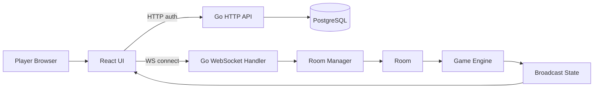
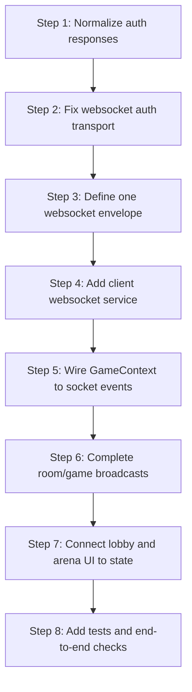
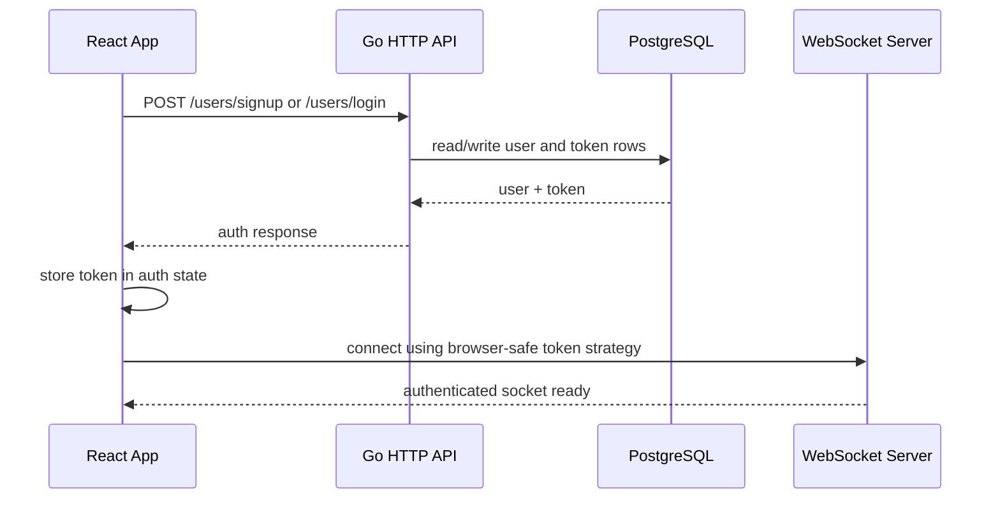
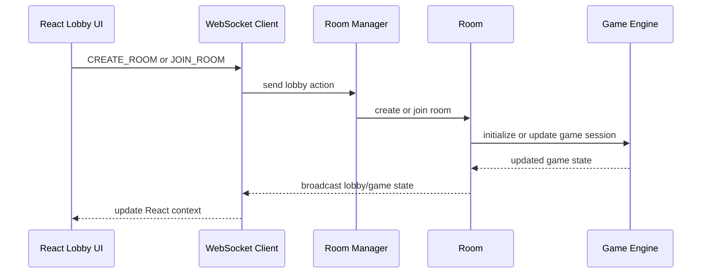

# Integration Roadmap

This document explains how to finish the project by connecting the Go backend and the React web client into one coherent runtime.

The current state is good for UI exploration, but not yet complete for a real multiplayer game:

- The backend exposes auth and websocket entry points.
- The frontend renders the game UI and auth UI.
- The two sides do not yet share a stable message contract.
- The game websocket flow exists on the server, but the client does not yet drive it.

The goal of this roadmap is simple:

1. Make auth reliable.
2. Make websocket connection reliable.
3. Make lobby and arena state flow through one shared contract.
4. Make the game loop actually progress.
5. Make the UI reflect the server state instead of local mock state.

---

## System View

The important design rule is that the browser should never invent authoritative game state. The browser can render animations and local UX, but the backend must remain the source of truth for:

- authenticated user identity
- room membership
- room capacity
- round state
- timer state
- score updates
- win/lose events

If the client and server disagree, the server wins.

---

## What Exists Today

### Backend already present

- `server/main.go` starts the HTTP server.
- `server/internals/route/route.go` registers `/users/signup`, `/users/login`, and `/ws/rooms`.
- `server/internals/api/user-handler.go` handles signup and login.
- `server/internals/middleware/middleware.go` validates auth tokens.
- `server/internals/ws/manager.go` owns the lobby and room channels.
- `server/internals/ws/client.go` reads and writes websocket messages.
- `server/internals/ws/room.go` defines the room lifecycle structure.
- `server/internals/events/events.go` defines the message envelope.

### Frontend already present

- `web-client/src/services/api.ts` handles HTTP auth.
- `web-client/src/state/context/auth-context.tsx` stores auth state.
- `web-client/src/pages/auth-gate.tsx` handles login and signup forms.
- `web-client/src/pages/game/lobby/game-lobby.tsx` renders lobby UI.
- `web-client/src/pages/game/arena/game-arena.tsx` renders arena UI.
- `web-client/src/state/context/game-context.tsx` is intended to hold game state.
- `web-client/src/types/messages.ts` and `web-client/src/types/type.ts` define client-facing types.

---

## The Main Integration Problem

The project is missing a single stable integration contract.

At the moment:

- HTTP auth uses one set of request/response shapes.
- Websocket messages use another set of message shapes.
- The frontend routes use one naming scheme.
- The backend websocket code uses another naming scheme.
- The room/game loop is only partly wired.

That means the UI can render, but it cannot reliably control the server.

The fix is not to add more UI first. The fix is to establish the contract first, then wire the UI to it.

---

## Recommended Implementation Order

Do not start with the arena UI logic. The UI is already visually good enough to sit on top of the real state machine. The missing piece is the state machine itself.

---

## High-Level Integration Rules

### Rule 1: HTTP is for identity

Use HTTP for:

- signup
- login
- token creation or refresh
- user profile bootstrap

### Rule 2: WebSocket is for live game state

Use WebSocket for:

- joining lobby
- creating room
- joining room
- leaving room
- submitting a word
- pausing or resuming game state
- broadcasting timer, score, round, and room updates

### Rule 3: Client state is derived

The React state should be a projection of the backend state.

That means the client should:

- connect
- send actions
- receive broadcasts
- update context/reducer state
- render based on that state

The client should not try to maintain a parallel authoritative room model.

---

## Where Integration Must Happen

| Concern | Current File | What Must Happen |
|---|---|---|
| Backend startup | `server/main.go` | Start one room manager loop once, not per socket connection |
| Route setup | `server/internals/route/route.go` | Expose a browser-compatible websocket auth flow |
| Auth handling | `server/internals/middleware/middleware.go` | Safely attach user identity to request context |
| WS entrypoint | `server/internals/ws/manager.go` | Create one manager instance and share it |
| Room loop | `server/internals/ws/room.go` | Consume inbound events and broadcast state |
| Socket client | `web-client/src/services/` | Add a websocket client module |
| Game state | `web-client/src/state/context/game-context.tsx` | Mount the correct provider and listen to socket events |
| Game types | `web-client/src/types/messages.ts` | Match backend message envelope exactly |
| Route paths | `web-client/src/App.tsx` and nav components | Make all paths consistent |

---

## Authentication Flow

Why this matters:

- the browser can keep the user logged in across refreshes
- the websocket can know who is sending actions
- the room manager can use the authenticated user identity for room membership

---

## Game Flow

This is the loop you want to complete. Once this loop exists, every other feature becomes much easier.

---

## Minimal Completion Checklist

1. Make auth responses and request bodies consistent across frontend and backend.
2. Decide how the websocket receives the token from the browser.
3. Define one canonical websocket envelope.
4. Create a websocket client service in the frontend.
5. Add a game provider that listens to socket events.
6. Make room manager and room loops broadcast state changes.
7. Remove route mismatches in navigation and game pages.
8. Add tests for login, websocket connect, room join, and room broadcast.

---

## Why This Order Is Best

This order reduces rework.

If you wire the UI too early, you will spend time rewriting components after the backend contract changes.

If you wire the backend too late, you will keep building mock UI that cannot talk to real game state.

If you normalize the contract first, both sides can be implemented in parallel.

---

## Practical End State

When the project is complete, this should be true:

- The user signs up or logs in through HTTP.
- The token is stored once and reused.
- The websocket opens with the authenticated user.
- The lobby shows live room data.
- The user can create or join rooms.
- The arena reflects live timer and score updates.
- The server owns the authoritative state.
- The UI is only a renderer plus input layer.
