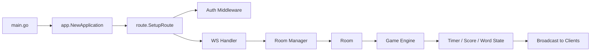
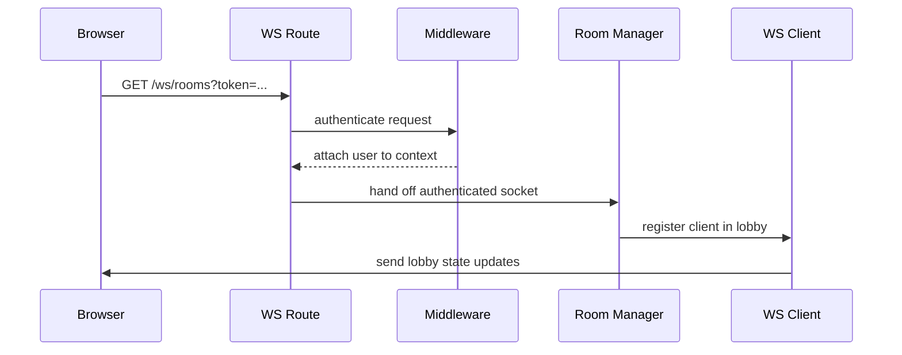
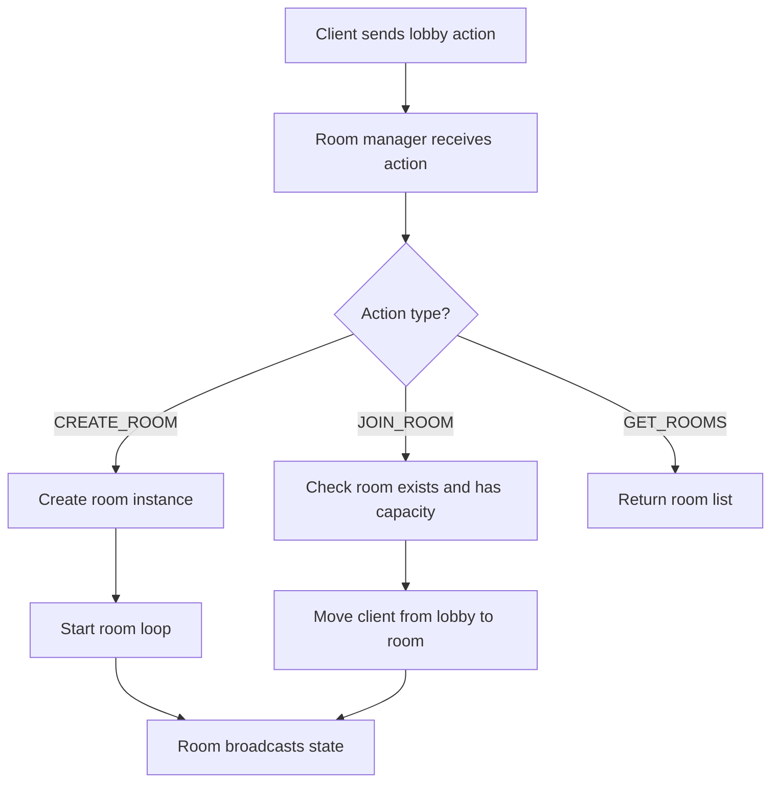

# Backend Completion Guide

This document explains how to finish the Go backend so it can properly power the web client.

The backend already has the right building blocks, but several parts are not yet connected in a production-safe way.

The key backend responsibilities are:

- authenticate the player
- manage websocket connections
- maintain room membership
- run the room/game state loop
- broadcast state changes back to the browser

---

## Backend Architecture

The backend should be thought of as a set of layers:

1. HTTP layer for auth.
2. Middleware layer for identity.
3. Websocket layer for real-time actions.
4. Room layer for live session management.
5. Engine layer for game logic.

---

## Current Backend Gaps

### 1. Room manager loop starts in the wrong place

In `server/internals/ws/manager.go`, the manager loop is started from inside `HandleWS`.

That means every socket connection can start a new manager loop.

Why this is a problem:

- multiple loops compete over the same channels
- lobby state may be handled more than once
- memory usage grows as clients connect
- shutdown becomes hard to reason about

What to do instead:

- create one manager at application startup
- start `Run()` once in a goroutine
- keep the same manager instance for all websocket connections

### 2. Room does not yet process game events

In `server/internals/ws/room.go`, the room loop handles join and leave, but not the inbound game events.

Why this matters:

- users can connect, but no actual game turn can progress
- word submissions do not update room state
- timers and scores do not broadcast

What to do instead:

- add handling for `inboundEvents`
- translate client actions into engine actions
- push broadcasts into each client channel

### 3. Browser auth transport is not yet websocket-safe

The websocket route currently relies on the auth middleware reading `Authorization` from the HTTP request.

That is fine for normal fetch calls, but browsers cannot reliably attach custom headers to native `WebSocket` handshakes.

Why this matters:

- the browser may connect without auth
- `RequireAuth` may reject legitimate clients
- the socket layer and the client will disagree on how auth works

What to do instead:

- use a token query parameter, or
- use a cookie-based session, or
- authenticate the socket immediately after connect with a first message

The simplest integration path is to standardize on a query token for the websocket handshake if you want minimal code change.

---

## Recommended Backend Wiring

### A. Application startup

Move manager creation into application setup so there is one shared manager instance.

Suggested ownership:

- `app.NewApplication()` creates the room manager
- `route.SetupRoute()` receives that manager through the application struct
- `HandleWS()` only upgrades the connection and registers the client

### B. Websocket connection lifecycle

### C. Room lifecycle

---

## File-by-File Backend Integration

### 1. `server/main.go`

Purpose:

- create the application
- create one manager
- start the HTTP server

What to integrate here:

- initialize the room manager once
- start the manager goroutine once
- pass it into the route setup through the application struct

Why:

- this is the top-level bootstrapper
- it should own long-lived services

### 2. `server/internals/app/app.go`

Purpose:

- wire stores, handlers, middleware, and shared runtime services

What to integrate here:

- add the room manager to the `Application` struct
- construct it during app startup
- keep it shared across the entire server lifetime

Why:

- app setup is the cleanest place to build long-lived dependencies

### 3. `server/internals/route/route.go`

Purpose:

- declare all HTTP and websocket routes

What to integrate here:

- route auth endpoints as they are
- route websocket endpoint to the shared room manager
- ensure auth middleware is compatible with the browser socket strategy

Why:

- route configuration should not create application state
- it should only connect handlers to the shared app services

### 4. `server/internals/ws/manager.go`

Purpose:

- keep lobby and room state in one place

What to integrate here:

- one loop for lobby joins/leaves and lobby actions
- room creation and discovery logic
- room registry access guarded by locks

Why:

- this is the central coordinator for all connected clients

### 5. `server/internals/ws/room.go`

Purpose:

- own the state for one room

What to integrate here:

- process inbound game actions
- coordinate with the engine
- broadcast updated room state
- manage join and leave events cleanly

Why:

- rooms are the unit of gameplay
- the game engine should not have to know about HTTP or browser concerns

### 6. `server/internals/ws/client.go`

Purpose:

- adapt socket bytes into typed actions and typed broadcasts

What to integrate here:

- decode the browser message envelope
- route lobby messages to the room manager
- route game messages to the room
- serialize broadcasts back to the browser

Why:

- this is the protocol adapter between the browser and the backend

---

## Backend Message Contract

The server already defines a canonical envelope in `server/internals/events/events.go`:

- `RawMessage`
- `InlobbyUserAction`
- `IngameUserAction`
- `LobbyStateBroadcast`
- `GameStateBroadcast`

The contract should stay stable and be mirrored by the frontend.

Recommended meaning:

- `msg_type` tells the server whether the message belongs to lobby state or game state.
- `payload` holds the typed action body.

### Why the envelope is useful

- it keeps the socket protocol small
- it allows future extension without breaking every client
- it keeps lobby and game actions separate

---

## Backend Completion Checklist

1. Create one shared room manager instance at app startup.
2. Start the manager loop once.
3. Make the websocket auth path browser-compatible.
4. Align the middleware behavior with the websocket connection strategy.
5. Add room event handling for `CREATE_ROOM`, `JOIN_ROOM`, and `GET_ROOMS`.
6. Add game event handling for submit/pause/resume/stop actions.
7. Broadcast room and game updates back to connected clients.
8. Add tests for auth, room join, and websocket broadcast behavior.

---

## Backend End-State

When backend integration is complete, the server should behave like this:

- one HTTP API handles auth
- one websocket service handles live game state
- one room manager owns all active rooms
- each room has a game loop
- clients only send intent and receive state
- the server remains authoritative
