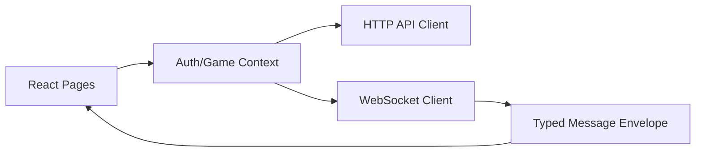
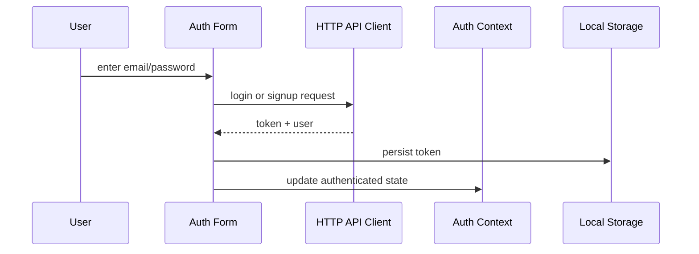
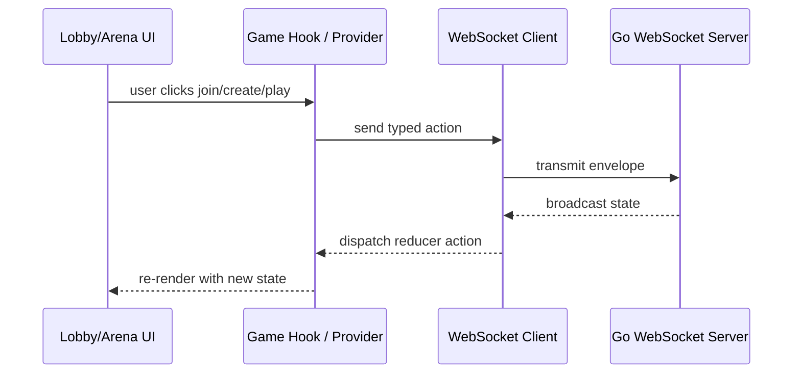

# Frontend Integration Guide

This document explains how to connect the React UI to the backend in a clean and maintainable way.

The frontend already has strong visual work. What it lacks is a real runtime bridge to the backend.

The frontend must do three things well:

1. Authenticate the user.
2. Connect to the websocket.
3. Render state from the server.

---

## Frontend Architecture

The important principle is separation of concerns:

- pages render screens
- contexts manage app state
- services talk to the backend
- types define the contract

---

## What Exists Today

The client already has:

- `web-client/src/services/api.ts` for auth HTTP calls
- `web-client/src/state/context/auth-context.tsx` for auth state
- `web-client/src/pages/auth-gate.tsx` for login/signup UI
- `web-client/src/pages/game/lobby/game-lobby.tsx` for lobby UI
- `web-client/src/pages/game/arena/game-arena.tsx` for arena UI
- `web-client/src/state/game-reducer.ts` for game state transitions
- `web-client/src/types/messages.ts` for message shapes

The missing pieces are connection wiring and contract alignment.

---

## Main Frontend Gaps

### 1. The game provider is mounted incorrectly

In `web-client/src/state/context/game-context.tsx`, the provider currently renders the auth provider instead of the game provider.

Why this matters:

- the game state context is never actually provided
- game screens cannot receive state updates properly

Fix:

- return `GameContext.Provider`

### 2. There is no websocket client service

The frontend currently has an HTTP API service, but no socket service.

Why this matters:

- the lobby cannot send create/join events
- the UI cannot listen for room or game broadcasts

Fix:

- add a websocket client module under `web-client/src/services/`
- connect it from a game hook or game provider

### 3. The frontend message types do not match the backend

`web-client/src/types/messages.ts` currently uses a different structure from `server/internals/events/events.go`.

Why this matters:

- the socket payloads will not decode correctly
- TypeScript may compile while runtime decoding fails

Fix:

- mirror the backend envelope exactly

### 4. Route paths are inconsistent

The app router and navigation components point at different URL shapes.

Why this matters:

- the app can appear broken even when the state is correct
- active nav styling becomes unreliable

Fix:

- choose one route naming convention and apply it everywhere

---

## Recommended Frontend Wiring

### Auth flow

### Websocket flow

---

## File-by-File Frontend Integration

### 1. `web-client/src/services/api.ts`

Purpose:

- handle login and signup HTTP requests

What to integrate here:

- keep token injection
- ensure the base URL matches the backend dev server
- normalize error response handling

Why:

- auth must be consistent and reusable everywhere

### 2. `web-client/src/state/context/auth-context.tsx`

Purpose:

- keep auth state and login/signup actions in one place

What to integrate here:

- restore token on app boot
- persist token in local storage
- expose a single auth source of truth

Why:

- the app should not re-authenticate on every screen change

### 3. `web-client/src/state/context/game-context.tsx`

Purpose:

- hold live game state

What to integrate here:

- mount the correct provider
- connect reducer and socket events
- dispatch lobby and arena state transitions

Why:

- the game UI needs a durable state bridge

### 4. `web-client/src/state/game-reducer.ts`

Purpose:

- represent game flow transitions

What to integrate here:

- align actions with real server events
- add statuses that match actual room/game lifecycle

Why:

- state transitions become predictable and testable

### 5. `web-client/src/types/messages.ts`

Purpose:

- define the browser-side websocket contract

What to integrate here:

- mirror the backend envelope
- keep lobby and ingame actions explicit

Why:

- typed sockets prevent broken payloads from spreading through the app

### 6. `web-client/src/pages/game/lobby/game-lobby.tsx`

Purpose:

- allow the player to create, list, and join rooms

What to integrate here:

- dispatch socket actions from buttons
- render room data from game state
- replace placeholder cards with live data

Why:

- lobby should be a real entry point into play, not a static showcase

### 7. `web-client/src/pages/game/arena/game-arena.tsx`

Purpose:

- show active game state

What to integrate here:

- render timer, score, word, and success feedback from server state
- send word submissions through the socket service

Why:

- the arena is where the live game must feel immediate and responsive

### 8. `web-client/src/App.tsx`

Purpose:

- define top-level navigation and route gating

What to integrate here:

- ensure authenticated users can reach game routes
- ensure route names match nav links

Why:

- the app shell controls how the user enters the game

---

## Recommended Frontend State Model

The auth state and game state should be separate.

Auth state should answer:

- who is the user
- is the user logged in
- what token is stored

Game state should answer:

- which room is active
- who is in the room
- what is the current word
- how many seconds remain
- what the scores are
- whether the round is idle, waiting, playing, or ended

Do not mix these two domains.

---

## Browser-Safe WebSocket Strategy

Because browsers cannot set arbitrary websocket headers the same way fetch can, the frontend needs a transport plan.

Recommended options, in order:

1. Query token in websocket URL.
2. HttpOnly cookie session.
3. First-message authentication after connect.

For this codebase, the simplest implementation is usually query token, because it requires the least amount of restructuring.

If you use query token, the frontend socket URL should be built from the same base URL used by the HTTP client.

---

## Frontend Completion Checklist

1. Fix the game context provider.
2. Add a websocket service.
3. Align client message types with the server envelope.
4. Dispatch reducer actions from websocket broadcasts.
5. Replace mock lobby cards with live room data.
6. Wire the arena UI to server-driven timer and score state.
7. Normalize route names across router and nav components.
8. Add client tests for auth, reducer transitions, and socket event handling.

---

## Frontend End-State

When complete, the frontend should behave like this:

- a user can log in and remain authenticated
- the lobby fetches live room state
- the player can create or join a room
- the arena listens to live broadcasts
- the UI updates instantly without manual refresh
- the visible state always reflects the server
